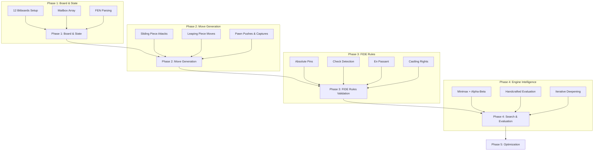

<p align="center">
  
</p> 

<p align="center">
  <a href="https://github.com/shashwat12jha/Chaturanga/releases"></a>
  <a href="https://github.com/shashwat12jha/Chaturanga/blob/main/LICENSE"></a>
  
  
  
  
</p>

<h3 align="center">A high-performance classical chess engine and premium custom GUI — built entirely from scratch in Java.</h3>

<p align="center">
  <a href="#quick-start">Quick Start</a> •
  <a href="#the-engine">The Engine</a> •
  <a href="#the-interface">The Interface</a> •
  <a href="#architecture">Architecture</a> •
  <a href="#build-from-source">Build from Source</a> •
  <a href="#development-journey">Development</a> •
  <a href="#benchmarks">Benchmarks</a>
</p>

---

## 📖 Table of Contents

- [Overview](#overview)
- [Quick Start](#quick-start)
- [The Engine](#the-engine)
- [The Interface](#the-interface)
- [Architecture](#architecture)
- [Build from Source](#build-from-source)
- [Development Journey](#development-journey)
- [Benchmarks & Correctness](#benchmarks)
- [Roadmap](#roadmap)
- [License](#license)

---

<a id="overview"></a>
## 🌟 Overview

**Chaturanga** (Sanskrit: *चतुरङ्ग*, the ancient predecessor of chess) is a flagship software engineering project demonstrating deep algorithmic knowledge, low-level optimization, and custom UI craftsmanship. Named after the original game from which chess evolved, it honors the heritage of the game while pushing the boundaries of what a handcrafted Java engine can do.

The project is divided into two completely decoupled components:

| Component | Description |
|---|---|
| `engine-core` | A pure UCI-compatible chess engine built on zero-allocation bitboards. No Stockfish source, NNUE networks, or external libraries. |
| `client` (GUI) | A premium custom Swing interface with live coaching, animated controls, and smooth async rendering. |

> **No Java installation required!** The Windows release is a self-contained native executable bundled with its own minimized JRE.

---

<a id="quick-start"></a>
## 🚀 Quick Start

**Just want to play?**

1. Go to the [**Releases**](https://github.com/shashwat12jha/Chaturanga/releases) tab.
2. Download `Chaturanga-Windows.zip`.
3. Extract anywhere → double-click `Chaturanga.exe`.

That's it. No Java. No setup. Just chess.

---

<a id="the-engine"></a>
## 🧠 The Engine

The `engine-core` is written in pure Java and implements a full UCI-compatible chess engine from first principles. It is intentionally separated from the GUI, making it loadable into any UCI-compatible frontend (Arena, CuteChess, etc.).

### ♟️ Board Representation

- **12 Bitboards + Mailbox Hybrid** — Twelve 64-bit `long` values represent each piece type for each color, with an `a1=0` square indexing convention. A parallel mailbox provides O(1) piece-type lookup on a given square.
- **FEN Parser/Serializer** — Strict six-field FEN parsing and serialization for position interchange.
- **Incremental Zobrist Hashing** — A fully deterministic Zobrist hash is updated incrementally on every `make`/`unmake` for zero-cost position identification.

### ⚡ Move Generation

- **Complete Legal Move Generation** — Checks, absolute pins, both castles (with occupancy validation), en passant, and all promotions are handled correctly.
- **Attack Tables** — Pre-computed sliding piece attack tables (Rook, Bishop, Queen) using classical techniques for high-speed lookup.
- **Reversible Make/Unmake** — Full state restoration including repetition detection state, fifty-move counter, and castling rights.

### 🔍 Search

The search is a classic **Principal Variation Search (PVS)** built on fail-soft negamax, driven by iterative deepening.

| Technique | Description |
|---|---|
| **Iterative Deepening** | Progressively deeper searches. The best move is always ready when time runs out. |
| **Alpha-Beta Pruning** | Cuts branches that cannot influence the result, drastically reducing the search tree. |
| **Aspiration Windows** | Re-searches with a narrow window around the previous score for faster cutoffs at higher depths. |
| **Transposition Table (TT)** | Zobrist-keyed hash table caches `exact`, `lower-bound`, and `upper-bound` entries. Mate scores are normalized for correctness across TT hits. |
| **Null Move Pruning (NMP)** | Passes a turn and searches at reduced depth. If the position is still losing, it prunes the branch. |
| **Late Move Reductions (LMR)** | Reduces search depth for moves ordered late (likely bad), with conservative tuning to avoid missed tactics. |
| **Quiescence Search** | Extends the search at leaf nodes to resolve all captures, preventing the horizon effect. |
| **Check Extensions** | Extends the search by one ply when the side to move is in check. |
| **Futility Pruning** | At shallow depths, prunes quiet moves that cannot raise alpha by a specific margin. |

### 📐 Evaluation

The evaluator (`ClassicalEvaluator`) is a fully handcrafted, deterministic **tapered evaluation** that blends middlegame and endgame scores based on remaining material (game phase).

- **Material** — Standard piece values, properly phased.
- **Piece-Square Tables (PST)** — Generated piece-square terms for each piece type in both middlegame and endgame phases.
- **Mobility** — Counts pseudo-legal moves for each piece, rewarding active pieces.
- **Pawn Structure** — Penalizes isolated and doubled pawns; rewards connected pawns.
- **Passed Pawns** — Passed pawns are awarded bonuses scaled by advancement rank.
- **Bishop Pair** — Rewards the bishop pair bonus in open positions.
- **King Safety & Shelter** — Evaluates pawn shield integrity and open files near the king.

### 🎯 Move Ordering

Good move ordering is the key to alpha-beta efficiency. Chaturanga uses a four-tier ordering cascade:

```
1. TT Best Move      (hash move from previous iteration)
2. Captures (SEE)    (Static Exchange Evaluation — winning captures first)
3. Killer Moves      (two quiet moves that caused a cutoff at this ply)
4. History Heuristic (quiet moves ordered by cumulative search success)
```

**Static Exchange Evaluation (SEE)** evaluates an entire capture sequence on a square without recursion, determining if a capture is ultimately winning or losing material — critical for both move ordering and Quiescence Search pruning.

### 🛡️ UCI Protocol

The engine exposes a clean UCI boundary via `uci/UciMain`:

```
uci          → engine info
isready      → readyok
position startpos moves e2e4 e7e5
go depth 6   → bestmove e2e4
go movetime 1000
quit
```

**Diagnostics:**
```
perft 4      → node count per move + total
bench 5      → depth-5 search, NPS, deterministic signature
d            → ASCII board + FEN + Zobrist key
```

---

<a id="the-interface"></a>
## 🎨 The Interface

A major focus of this project was breaking out of the ugly, dated look of standard Java Swing applications.

### ✨ Visual Design
- **HSL-tailored color palette** — Every color in the UI is handpicked using HSL for harmony and contrast, not just defaults.
- **Antialiasing everywhere** — All custom rendering uses `RenderingHints.VALUE_ANTIALIAS_ON` for pixel-perfect, smooth shapes.
- **Strict pixel-perfect layout** — Advanced `CardLayout` and `GridBagLayout` configurations ensure the board is always perfectly centered, with zero ghosting or layout shifts.

### 🎛️ Custom Controls
- **iOS-style Animated Toggle Switches** — Custom-painted `JComponent` subclasses with smooth sliding animation, replacing every `JCheckBox` in the toolbar.
- **Interactive Evaluation Bar** — A dynamic centipawn bar that animates in real time as the engine thinks.

### 🧑‍🏫 Live Coaching Mode
- **Real-time Move Analysis** — After every move, the engine asynchronously analyses the position and reports the centipawn loss or gain.
- **Best Move Highlighting** — Coaching mode overlays the engine's suggested best move directly on the board.
- **Engine vs. Engine** — Watch the engine play itself, with full coaching analysis running simultaneously.

### ⚙️ Threading Model
The GUI maintains absolute UI responsiveness through a strict threading discipline:

```
Event Dispatch Thread (EDT)  →  All Swing painting and user events
Async Executor Pool          →  All engine computation (search, analysis)
```

The `NewEngineAdapter` decouples the engine from the GUI entirely, communicating only through callbacks on the EDT via `SwingUtilities.invokeLater`. **Zero UI locking. Zero ghosting.**

---

<a id="architecture"></a>
## 🏗️ Architecture

```
Chaturanga/
├── engine-core/                  # 🔧 The search engine (standalone UCI JAR)
│   └── src/
│       ├── Position.java         # Board state + make/unmake
│       ├── Move.java             # Move encoding (from/to/flags in a packed int)
│       ├── AttackTables.java     # Pre-computed sliding attack lookups
│       ├── MoveGenerator.java    # Complete legal move generation
│       ├── ClassicalEvaluator.java # Tapered HCE: material, PST, mobility, pawns
│       ├── SearchEngine.java     # PVS + iterative deepening + all pruning
│       ├── TranspositionTable.java # Zobrist-keyed TT with mate normalization
│       ├── SEE.java              # Static Exchange Evaluation
│       └── uci/UciMain.java      # UCI protocol boundary
│
├── src/main/java/                # 🎨 The Swing GUI (main application)
│   ├── gui/
│   │   ├── GameWindow.java       # Core orchestrator and layout manager
│   │   ├── BoardPanel.java       # Custom chess board rendering
│   │   ├── ToggleSwitch.java     # Animated iOS-style toggle switches
│   │   ├── EvalBar.java          # Live centipawn evaluation bar
│   │   └── NewEngineAdapter.java # Engine ↔ GUI decoupling layer
│   └── main/Main.java            # Application entry point
│
├── client/                       # 🌐 Web client (React/Vite)
├── server/                       # 🖥️ Backend server
├── build.gradle                  # Multi-project Gradle build
└── gradlew / gradlew.bat         # Gradle wrapper
```

---

<a id="build-from-source"></a>
## 🔨 Build from Source

### Prerequisites
- **JDK 24+** on `PATH`
- **Windows PowerShell** (for the supplied build wrappers)

No third-party dependencies. No Maven Central. Pure Java.

### Build the Engine

```bat
cd engine-core
.\build.cmd
```

The engine JAR is output to `engine-core\build\chaturanga-engine.jar`.

### Run as UCI Engine

```bat
cd engine-core
.\run.cmd
```

**Load into any UCI GUI:**
```
java -jar C:\absolute\path\to\engine-core\build\chaturanga-engine.jar
```

### Build the Full Application

```bash
# Clone the repository
git clone https://github.com/shashwat12jha/Chaturanga.git
cd Chaturanga

# Build using the Gradle wrapper
./gradlew build -x test

# Package as a self-contained native Windows executable
./gradlew installDist
jpackage --name "Chaturanga" \
         --input "build/install/Chaturanga/lib" \
         --main-jar "Chaturanga-1.0-SNAPSHOT.jar" \
         --main-class "main.Main" \
         --type app-image \
         --dest "build/dist"
```

### Run Engine Tests

```bat
cd engine-core
.\test.cmd
```

All 101 automated assertions must pass, including complete perft suites.

---

<a id="development-journey"></a>
## 🛠️ Development Journey

Building a chess engine from scratch is a complex process. The development of Chaturanga evolved through several key stages, transitioning from basic board representation to a fully optimized classical engine.



### 1. Building the Board Representation
The foundation of Chaturanga is its zero-allocation bitboard architecture. Instead of representing the board as a 2D array, the state is maintained using 64-bit integers (`long` in Java), where each bit corresponds to a square. This allows for lightning-fast bitwise operations for piece placement and movement. A parallel mailbox system provides O(1) piece lookup.

### 2. Defining Piece Movements
Move generation is split between sliding pieces (Rooks, Bishops, Queens) and leaping pieces (Knights, Kings). For sliding pieces, classical attack tables were pre-computed. Pawn movements required special attention due to their directional nature, double-pushes, and promotion logic.

### 3. Applying FIDE Rules
A chess engine must strictly adhere to all FIDE rules. Implementing these constraints involved:
- **Pin Detection**: Pieces cannot move if it exposes their King to check.
- **Check Evasion**: When in check, the only legal moves are to capture the attacker, block the attack, or move the King.
- **En Passant**: A complex rule requiring specific state tracking from the previous move.
- **Castling**: Validating castling rights, ensuring the King and Rook haven't moved, and verifying the King does not pass through attacked squares.
- **Draw Conditions**: Fifty-move rule and threefold repetition detection.

### 4. Search and Evaluation
With a fully legal move generator in place, the engine was endowed with intelligence using the Principal Variation Search (PVS) algorithm and Alpha-Beta pruning. A custom classical evaluation function was crafted to assess material, mobility, piece-square tables, and pawn structures.

---

<a id="benchmarks"></a>
## 📊 Benchmarks & Correctness

All figures are from the reference development machine (JDK 24, July 2026). Correctness counts are invariant across machines; NPS figures vary by hardware and JVM warm-up.

### ✅ Automated Test Suite

```
101 assertions passed ✓
```

### ♟️ Perft Results (Move Generation Correctness)

| Position | Depth 1 | Depth 2 | Depth 3 | Depth 4 |
|---|---|---|---|---|
| **Start Position** | 20 | 400 | 8,902 | 197,281 |
| **Kiwipete** | 48 | 2,039 | 97,862 | — |
| **En Passant / Endgame Suite** | 14 | 191 | 2,812 | 43,238 |

### ⚡ Search Performance

| Metric | Value |
|---|---|
| **Depth-5 Benchmark Nodes** | 181,600 |
| **Nodes Per Second (NPS)** | ~335,000 |
| **Signature** | `c9355990b326d2a3` |

> Signature is a deterministic hash of the search results. It must remain constant across all correct builds.

---

<a id="roadmap"></a>
## 🗺️ Roadmap

- [ ] **Strength improvements** via measured A/B self-play and tactical test suites
- [ ] **Opening book** integration (via UCI `OwnBook` option)
- [ ] **Endgame tablebases** (Syzygy support)
- [ ] **Web client** — play against the engine in a browser via the `client/` module
- [ ] **Server** — expose the engine as a REST/WebSocket service via the `server/` module
- [ ] **macOS & Linux** — native packaging for other platforms

---

<a id="license"></a>
## 📜 License

Distributed under the **MIT License**. See [`LICENSE`](LICENSE) for full terms.

---

<p align="center">
  <sub>Built with ♟️ and a lot of bitwise math · No Stockfish source, NNUE networks, or opening-book data were used.</sub>
</p>
